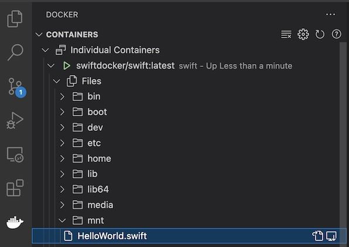

# Scripts for running Swift on Windows and Linux

## Swift compiler using docker

We use the [swift-docker](https://github.com/apple/swift-docker) project for a first introduction to the swift programming language.

To start the swift container run this:
```bash
./swift.sh
```

Then run the following in the console of the docker container:
```bash
swift HelloWorld.swift
```

## Development Environment without XCode

In order to have syntax coloring, you must install [VS-Code](https://code.visualstudio.com/) and the following plugins:
- [Remote Containers](https://marketplace.visualstudio.com/items?itemName=ms-vscode-remote.remote-containers)
- [Swift Language](https://marketplace.visualstudio.com/items?itemName=Kasik96.swift)


In the image below you can see how to open your source file:



Here you can edit your code and compile with the ```swift```command in the docker console again.

## Creating Packages

For larger projects you should run the following:

```bash
mkdir demo
cd demo
swift package init --type executable
swift build
swift run
swift test
```

The generated Package.swift is the entry point of every package, it tells us all there is to know about it, while main.swift is the entry point of your application. 

For details see "[The Ultimate Guide To Swift Executables](https://www.fivestars.blog/articles/ultimate-guide-swift-executables/)"

## watching for changes
```bash
find . -type f -name "*.swift" | entr ./watch.sh
``` 