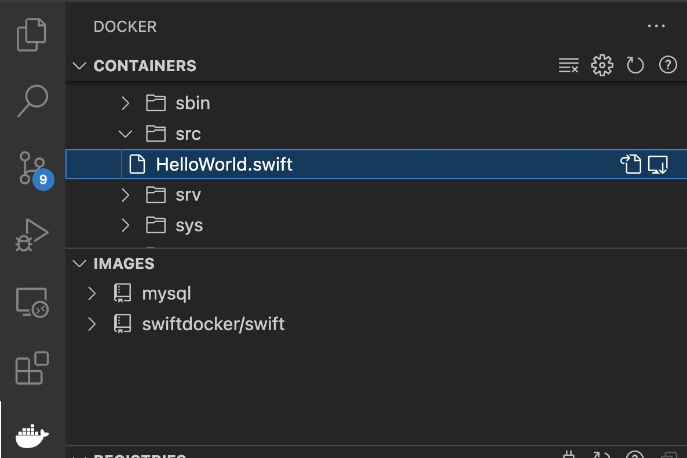

# Scripts for running Swift on Windows and Linux

## Swift compiler using docker

We use the [swift-docker](https://github.com/apple/swift-docker) project for a first introduction to the swift programming language.

To start the swift container run this:
~~~bash
./swift.sh
~~~

Edit your files in the ./src/ Subfolder and run the following in the swift console:
~~~bash
swift HelloWorld.swift
~~~

## Development Environment without XCode

In order to have syntax coloring, you must install [VS-Code](https://code.visualstudio.com/) and the following plugins:
- [Remote Containers](https://marketplace.visualstudio.com/items?itemName=ms-vscode-remote.remote-containers)
- [Swift Language](https://marketplace.visualstudio.com/items?itemName=Kasik96.swift)

In the image below you can see how to open your source file:

